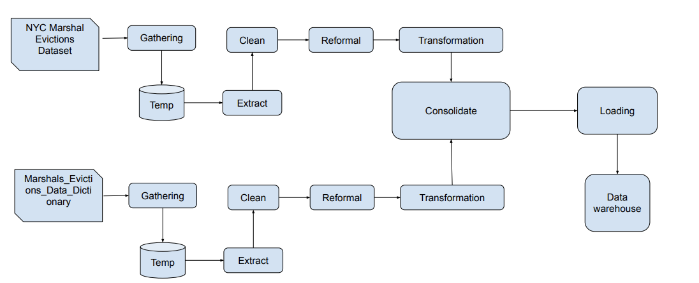
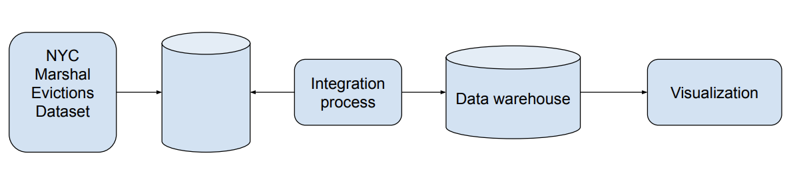

## CIS4400 Homework 1 

Evictions
This dataset lists executed evictions within the five boroughs for the years 2017-Present (data prior to January 1, 2017, is not available). The data fields may be sorted by 20 categories of information including Court Index Number, Docket Number, Eviction Address, Marshal First or Last Name, Borough, etc..

Eviction data is compiled from New York City Marshals. City Marshals are independent public officials appointed by the Mayor. Marshals can be contacted directly regarding evictions, and their contact information can be found at https://www1.nyc.gov/site/doi/offices/marshals-list.page.

Business requirement: 
The factors of investing a renting property will be neighborhood stability. If the area has more cases of evictions occur or the trend is going up can be variable of investing in the area. 
1.	Evaluate eviction rates and trends within specific NYC zip codes as an indicator of neighborhood stability to inform residential real estate investment analysis
2.	Identify overall eviction cases happen for Residential/Commercial, which has more eviction cases occur in last few years

Functional requirement: 
1.	Import and process the Eviction dataset 
2.	Filter and aggregate data by time, borough, cases, and type
3.	Comparison Residential and commercial
4.	Visualization the data 

Data 
	The data will collect from NYC open data, it is CSV files. The data include 20 columns and 106,000 rows. It has data dictionary associated with this data. 

Information Architecture
1.	user interactions
a.	input zipcode for analysis 
2.	data processing
a.	calculate the rates, trends and comparison
3.	data storage.
a.	The database will store data related to eviction cases, zip codes, property types, and calculated metrics

Diagram: 

## homework2 
	data is download from Data source: https://data.cityofnewyork.us/City-Government/Evictions/6z8x-wfk4/about_data and stored at azure 

	updated data dictionary in the og dictionary excel

	created new branch for a dimensional data warehouse to analyze eviction activity across New York City using public eviction datasets. The warehouse is designed using a star schema with `fact_eviction` as the central fact table and supporting dimension tables.

	docs/Dimensional Modeling.png
	
	use dbt created fact and dim table via snowflake in feature/etl 

	Track eviction volume by zipcode:
	

	Analyze trends by five boroughs  
	

	

	